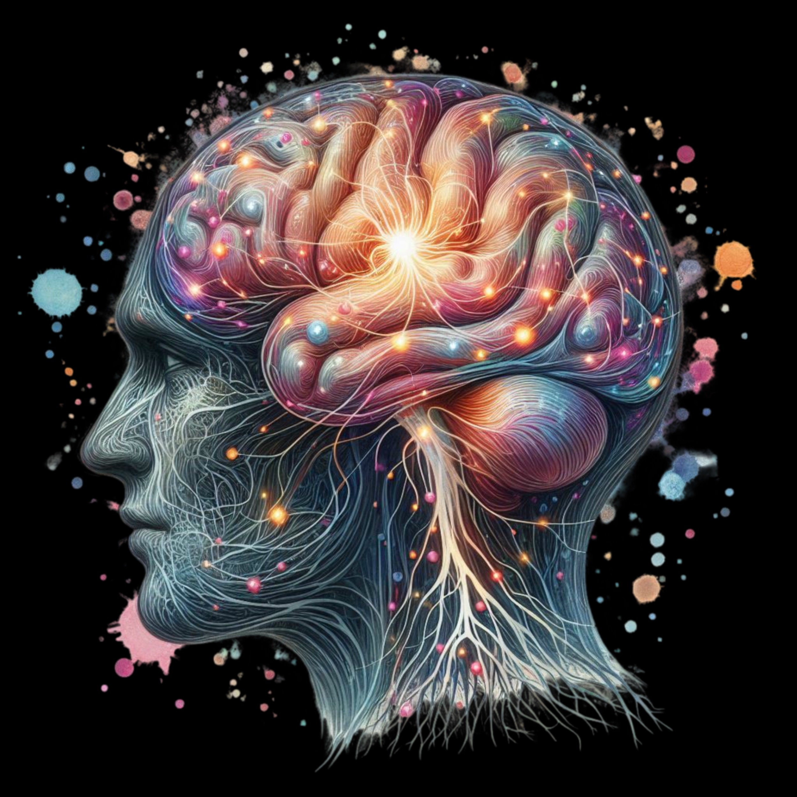

# 🧠 Scatterbrain AI

**Your thoughts, organized.**  
Capture anything, anywhere. Scatterbrain turns it into something real.

---

## ✨ What is Scatterbrain?

Scatterbrain is a magical thought capture system for nonlinear minds. It transforms scattered ideas into beautiful, structured outputs using AI — summaries, content, quotes, and clarity.

Built with:
- [v0.dev](https://v0.dev) (UI)
- [React](https://reactjs.org)
- [Tailwind CSS](https://tailwindcss.com)
- [Vercel](https://vercel.com) (hosting + CI)
- [GitHub](https://github.com) (version control)

---

## 🚀 Deploy

This project is automatically deployed via [Vercel](https://vercel.com).  
Push to `main` and your site updates instantly.

---

## 📦 Local Dev Setup

\`\`\`bash
# Clone the repo
git clone https://github.com/YOUR_USERNAME/scatterbrain.git
cd scatterbrain

# Install dependencies
npm install

# Run dev server
npm run dev
\`\`\`

Open [http://localhost:3000](http://localhost:3000) to see your site.

---

## 🛠 Project Structure

\`\`\`
scatterbrain/
├── app/                 # Next.js app directory
├── components/          # Reusable UI components
├── public/             # Static assets
├── styles/             # Global styles
└── README.md           # You are here
\`\`\`

---

## 🎨 Design System

- **Colors**: Black & white with subtle grays
- **Typography**: Clean, modern sans-serif
- **Layout**: Centered, responsive design
- **Components**: Built with shadcn/ui

---

## 📝 License

MIT License - feel free to use this for your own projects!

---

## 🧠 Vision

Scatterbrain isn't just a note tool — it's cognitive infrastructure.  
Built to help creators, founders, and thinkers unlock momentum.

---

## 📫 Stay in the Loop

Follow the journey → [scatterbrainai.com](https://scatterbrainai.com)  
Built in public by [@dreamberglabs](https://twitter.com/dreamberglabs)

---

## License

MIT © 2025 Aaron Greenberg / Dreamberg Labs

---

**Built with ❤️ and scattered thoughts**
